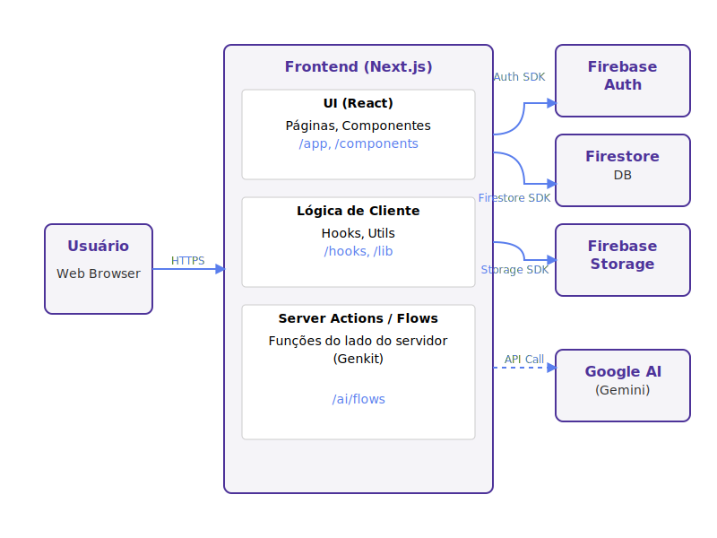

# MovaFin - Sua Gestão Financeira Simplificada

MovaFin é uma aplicação web moderna e intuitiva, projetada para ajudar usuários a gerenciar suas finanças pessoais de forma fácil e visual. Com uma interface limpa e recursos inteligentes, o MovaFin torna o controle de despesas e o planejamento de metas financeiras acessível para todos, especialmente para iniciantes.

## ✨ Core Features

- **Autenticação Segura:** Registro e login de usuários com dados isolados e privados.
- **Interface em Português:** Uma experiência de usuário totalmente em português do Brasil.
- **Gestão de Contas:** Crie e acompanhe múltiplas contas financeiras (corrente, poupança, etc.).
- **Registro Detalhado de Transações:** Adicione receitas e despesas com categoria, notas e anexos.
- **Categorização Flexível:** Crie e gerencie suas próprias categorias de transação e tipos de conta.
- **Dashboard Simplificado:** Um painel visual para um resumo claro da sua saúde financeira.
- **Explicador de Transações (IA):** Uma ferramenta de IA para decifrar jargões financeiros complexos.

## 🚀 Tech Stack

- **Framework:** Next.js (App Router)
- **UI:** React, TypeScript, ShadCN UI, Tailwind CSS
- **Inteligência Artificial:** Google Genkit
- **Backend:** Firebase (Authentication, Firestore, Storage)

## 🏛️ Arquitetura da Aplicação

A arquitetura do MovaFin foi projetada para ser moderna, segura e escalável, utilizando as melhores práticas do ecossistema Next.js e Firebase.



- **Frontend:** Construído com Next.js e React, utilizando o App Router para uma navegação otimizada e Server Components para melhor performance.
- **UI:** A interface é desenvolvida com ShadCN UI e Tailwind CSS, garantindo um design consistente, responsivo e acessível.
- **Backend & Banco de Dados:** O Firebase fornece todos os serviços de backend necessários:
    - **Firebase Authentication:** Para um sistema de autenticação seguro e fácil de usar.
    - **Firestore:** Como banco de dados NoSQL para armazenar todos os dados da aplicação (contas, transações, metas, etc.), garantindo isolamento de dados por usuário através de Security Rules.
    - **Firebase Storage:** Para o upload e armazenamento de arquivos, como comprovantes de transações.
- **Inteligência Artificial:** O Google Genkit é usado para orquestrar as chamadas aos modelos de IA do Google (Gemini), potencializando funcionalidades como o explicador de transações e a sugestão de categorias.

## 📂 Estrutura do Projeto

A estrutura de pastas do projeto foi organizada para promover a modularidade e facilitar a manutenção.

```
/
├── .env              # Variáveis de ambiente (chaves de API, etc.)
├── .next/            # Build de produção do Next.js
├── docs/             # Documentação do projeto (PRD, Requisitos, etc.)
├── public/           # Arquivos estáticos
├── src/
│   ├── app/          # Rotas, páginas e layouts do Next.js App Router
│   ├── components/   # Componentes React reutilizáveis (UI e de funcionalidade)
│   ├── lib/          # Funções utilitárias, tipos e dados mockados
│   ├── hooks/        # Hooks React customizados
│   ├── ai/           # Configuração e fluxos do Genkit (IA)
│   └── firebase/     # Configuração e hooks do Firebase (ainda a ser criado)
├── package.json      # Dependências e scripts do projeto
└── ...               # Outros arquivos de configuração (tailwind, tsconfig, etc.)
```
- **`src/app`**: Contém a estrutura principal de rotas da aplicação, seguindo o padrão do App Router do Next.js. Cada pasta corresponde a um segmento de URL.
- **`src/components`**: Abriga todos os componentes React. A subpasta `ui` é dedicada aos componentes do ShadCN, enquanto outros componentes reutilizáveis da aplicação ficam na raiz de `components`.
- **`src/lib`**: Centraliza a lógica de negócios, definições de tipos TypeScript (`types.ts`), funções utilitárias (`utils.ts`) e dados estáticos/mockados.
- **`src/hooks`**: Para hooks customizados que encapsulam lógica e estado, como o `use-toast`.
- **`src/ai`**: Onde toda a lógica de Inteligência Artificial com Genkit é definida. Os `flows` são as funções que interagem com os modelos de linguagem.
- **`docs`**: Toda a documentação do projeto, incluindo requisitos, decisões de arquitetura e cronograma.

## 📄 Documentação Completa

- [Product Requirements Document (PRD)](./docs/PRD.md)
- [Requisitos Funcionais](./docs/functional-requirements.md)
- [Casos de Uso](./docs/usecases.md)
- [Requisitos Não Funcionais](./docs/non-functional-requirements.md)
- [Cronograma de Desenvolvimento](./docs/cronograma.md)

## 🏃 Getting Started

Para rodar o projeto localmente:

1. **Instale as dependências:**
   ```bash
   npm install
   ```

2. **Rode o servidor de desenvolvimento:**
   ```bash
   npm run dev
   ```

A aplicação estará disponível em `http://localhost:9002`.
