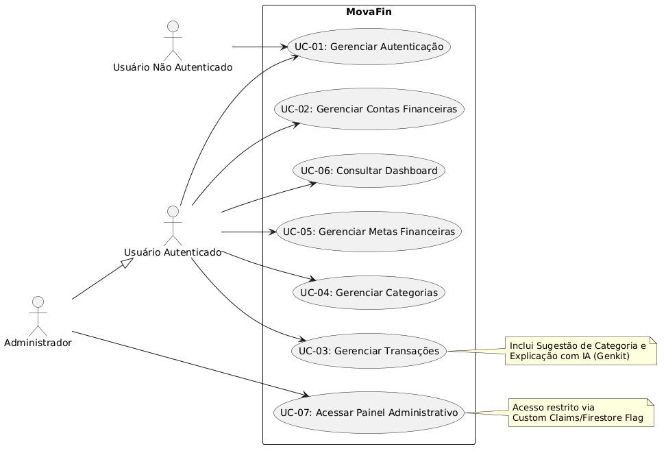

# Casos de Uso - MovaFin

Este documento detalha as interações entre os atores e o sistema MovaFin, descrevendo os fluxos de trabalho, condições e as regras que regem cada funcionalidade.

## Diagrama de Casos de Uso

*Nota: O diagrama acima é gerado a partir do código PlantUML presente em `docs/usecases.uml`.*

---

## Especificação dos Casos de Uso

### UC-01: Gerenciar Autenticação
- **Atores:** Usuário Não Autenticado, Usuário Autenticado, Administrador.
- **Resumo:** Permite o acesso seguro à plataforma, criação de novas contas e encerramento de sessão.
- **Pré-condições:** O ator deve possuir um e-mail válido para cadastro.
- **Pós-condições:** O ator é autenticado no sistema com acesso aos seus dados privados ou uma mensagem de erro clara é exibida.
- **Fluxo Principal (Login):**
    1. O ator acessa a página de login.
    2. O ator fornece e-mail e senha.
    3. O sistema valida as credenciais via Firebase Auth.
    4. O sistema verifica o papel do usuário (role).
    5. O sistema concede acesso e redireciona para o Dashboard.
- **Fluxos Alternativos:**
    - **A1 (Cadastro):** O usuário fornece nome, e-mail e senha; o sistema cria o perfil e inicializa o espaço de dados no Firestore.
    - **A2 (Logout):** O usuário aciona "Sair"; o sistema encerra a sessão e redireciona para a Landing Page.
- **Fluxos de Exceção:**
    - **E1 (Credenciais Inválidas):** O sistema exibe "E-mail ou senha incorretos".
    - **E2 (E-mail já cadastrado):** No cadastro, o sistema alerta que o e-mail já está em uso.
- **Regras de Negócio:**
    - **RN-01:** Senhas devem ter no mínimo 6 caracteres.
    - **RN-02:** O e-mail deve ser único e seguir formato válido.

### UC-02: Gerenciar Contas Financeiras
- **Atores:** Usuário Autenticado.
- **Resumo:** Controle das fontes de recursos (bancos, carteira, investimentos).
- **Pré-condições:** Nenhuma.
- **Pós-condições:** A conta é persistida e o saldo consolidado do usuário é atualizado.
- **Fluxo Principal:**
    1. O usuário acessa "Contas".
    2. O usuário preenche nome, tipo e saldo inicial.
    3. O sistema salva os dados vinculados ao UID do usuário.
- **Fluxos Alternativos:**
    - **A1 (Edição):** O usuário altera os dados de uma conta existente.
- **Regras de Negócio:**
    - **RN-03:** O saldo inicial não deve ser negativo na criação da conta.

### UC-03: Gerenciar Transações
- **Atores:** Usuário Autenticado.
- **Resumo:** Registro e monitoramento de entradas e saídas financeiras.
- **Pré-condições:** O usuário deve possuir pelo menos uma conta cadastrada.
- **Pós-condições:** Transação registrada, saldo da conta afetada atualizado e categoria vinculada.
- **Fluxo Principal:**
    1. O usuário aciona "Nova Transação".
    2. O usuário preenche valor, conta, categoria e data.
    3. O sistema atualiza o saldo da conta e persiste o registro.
- **Fluxos Alternativos:**
    - **A1 (Sugestão de Categoria):** O usuário usa o `AiCategorySuggester` para classificar o gasto automaticamente.
    - **A2 (Explicação IA):** O usuário usa o `AiExplainer` para entender descrições bancárias complexas.
- **Regras de Negócio:**
    - **RN-04:** Despesas subtraem do saldo da conta; receitas somam.

### UC-04: Gerenciar Categorias
- **Atores:** Usuário Autenticado.
- **Resumo:** Personalização das etiquetas de classificação de gastos e ganhos.
- **Pré-condições:** Nenhuma.
- **Pós-condições:** Novas categorias ficam disponíveis para seleção em transações.
- **Fluxo Principal:**
    1. O usuário acessa a página de Categorias.
    2. O usuário adiciona ou edita nomes de categorias.
- **Regras de Negócio:**
    - **RN-05:** Categorias "Padrão" do sistema não podem ser excluídas, apenas ocultadas ou editadas se permitido.

### UC-05: Gerenciar Metas Financeiras
- **Atores:** Usuário Autenticado.
- **Resumo:** Planejamento de objetivos financeiros com prazo e valor.
- **Pré-condições:** Nenhuma.
- **Pós-condições:** Meta criada com cálculo automático de progresso baseado no valor acumulado.
- **Fluxo Principal:**
    1. O usuário define nome, valor alvo e data limite.
    2. O usuário informa quanto já possui para essa meta.
    3. O sistema calcula a barra de progresso.
- **Regras de Negócio:**
    - **RN-06:** O valor alvo deve ser estritamente maior que o valor já acumulado informado.

### UC-06: Consultar Dashboard
- **Atores:** Usuário Autenticado.
- **Resumo:** Visão agregada da saúde financeira através de gráficos e métricas.
- **Pré-condições:** O usuário deve possuir dados cadastrados para visualização completa de métricas (opcional).
- **Pós-condições:** Exibição de gráficos de pizza/barra e saldos totais.
- **Regras de Negócio:**
    - **RN-07:** O saldo total é a soma algébrica de todas as contas do usuário.

### UC-07: Acessar Painel Administrativo
- **Atores:** Administrador.
- **Resumo:** Visualização de estatísticas globais e manutenção do sistema.
- **Pré-condições:** O usuário deve possuir privilégios administrativos atribuídos previamente.
- **Pós-condições:** Acesso a dados agregados anonimizados.
- **Regras de Negócio:**
    - **RN-08:** O administrador nunca deve visualizar dados sensíveis (descrições de transações) de usuários individuais, apenas dados agregados.